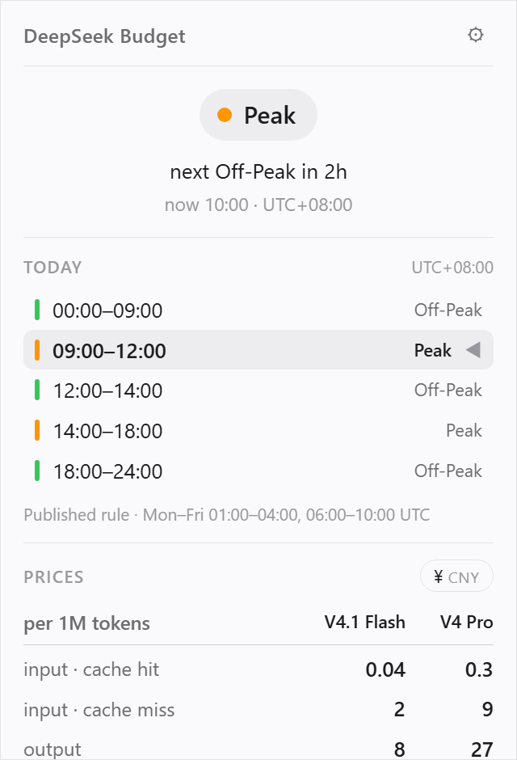

<p align="center">
  
</p>

# DeepSeek Budget

**English** · [简体中文](README.zh-CN.md)



A menu bar (macOS) / system tray (Windows) indicator for DeepSeek's API pricing. It answers two
questions:

1. Is the API **peak** or **off-peak** right now?
2. **When does that change**, and how long until then?

The icon is the DeepSeek whale in one of three colours — **blue** off-peak, **orange** peak,
**grey** unknown.

## Install

All four builds are in **[v0.3.3](https://github.com/FAAATQ/DeepSeekBudget/releases/tag/v0.3.3)**.

| Platform | Artifact | Notes |
|---|---|---|
| **Windows 10/11 (x64)** | `deepseek-budget.exe` | Portable, **no installer** — run it and the tray icon appears. Needs WebView2, which ships with Windows 11 and current Windows 10. |
| **macOS — Apple Silicon** | `deepseek-budget-macos-arm64.zip` | For **M1/M2/M3/M4** Macs. The smallest download. |
| **macOS — Intel** | `deepseek-budget-macos-x86_64.zip` | For Macs with an **Intel Core** processor. |
| **macOS — Universal** | `deepseek-budget-macos-universal.zip` | Runs on **both**. Take this one if you would rather not find out which Mac you have. |

**All three macOS builds are the same app** — same version, same source, just different machine code
inside. Unzip and run `DeepSeek Budget.app` wherever you put it; there is no installer.

**Which Mac do I have?** → About This Mac → look at **Chip**. "Apple M…" means arm64, "Intel Core…"
means x86_64. If you pick wrong, macOS simply refuses to open it — no damage done.

### Gatekeeper

None of the macOS builds are signed with an Apple Developer certificate or notarised. On first
launch macOS will refuse to open the app. Either **right-click the app → Open**, or:

```bash
xattr -dr com.apple.quarantine "DeepSeek Budget.app"
```

That is the one step a portable app cannot avoid on macOS.

Neither platform needs admin rights, and neither installs anything outside its own folder — which
is also why both can offer a login item.

## What it does

- **A tray icon that is always right**, driven by a Rust engine on a background thread. It keeps
  changing colour while the popover is closed.
- **A tooltip** with the current state, the next change, and the current price. Windows caps tray
  tooltips at 127 characters, so Windows gets a compressed three-line form.
- **A popover** with today's full schedule, the countdown, and the price table for every model.
- **Prices that keep themselves fresh.** A **Check for updates** button — or the automatic check,
  every 24 hours by default — pulls the latest figures and schedule from a small public config
  repository, so a price change by DeepSeek does not require this app to ship a new version. The
  copy bundled in the binary is the fallback, so **the app behaves identically whether or not it
  ever checks**. Settings shows the interval and when it last ran, and can turn it off entirely.
- **Launch at login**, off by default. Neither platform needs an installer for this; the entry is
  re-pointed at the app's current location on every launch, so a portable build that gets moved
  keeps working.
- **Chinese and English**, following the system language.

### Network

There is exactly one outbound request this app can make, and exactly one origin it can reach. It
is a plain `GET` for a public JSON file, and it happens in one of two ways: **you press Check for
updates**, or **the interval you chose in Settings comes round** — 24 hours by default, and only
while that setting is on. Set it to **Off** and the app goes back to never touching the network on
its own.

Nothing is ever sent, there is no telemetry, and there is no call at startup. The Rust dependency
tree contains no HTTP client and no TLS stack at all — the single `fetch` runs in the webview,
which already has one, against a Content-Security-Policy that allows exactly that one origin.

## Development

Prerequisites: Rust (stable ≥ 1.90), Node (only for the Tauri CLI), and on macOS the Xcode Command
Line Tools (**not** full Xcode).

```bash
npm install                                 # only to get @tauri-apps/cli
npm run dev                                 # launches; the icon appears in the menu bar

cargo test --workspace                      # 133 tests
cargo test -p deepseekbudget-schedule       # engine only, ~0.6 s

npx tauri build --bundles app               # macOS .app
cargo build --release -p deepseek-budget    # Windows portable exe
```

The engine (`crates/schedule`) has **zero Tauri dependencies** and never reads the system clock —
"now" is always a parameter. That is what makes every peak/off-peak boundary testable headlessly.

## Documentation

Code can be read. **Why it was built this way, and what each platform actually does** cannot.

| Document | Contents |
|---|---|
| [`docs/domain-pricing.md`](docs/domain-pricing.md) | The DeepSeek peak/off-peak rules this app encodes, how timezones are modelled, and how far the official API actually lets you measure your own spend |
| [`docs/windows.md`](docs/windows.md) | What the Windows port cost: popover positioning, the foreground lock, why acrylic forces square corners, the 127-character tooltip limit, and three traps in automating Windows UI verification |
| [`docs/macos.md`](docs/macos.md) | A `tray.rect()` that returns a zero-height rectangle, a monitor lookup that takes logical points while being handed physical pixels, who owns the corner radius, and a platform-verifiability claim that had to be retracted |
| [`docs/icon-pipeline.md`](docs/icon-pipeline.md) | How the tray icon is produced, why the canvas is 49×36 rather than square, and a measured comparison against shipping menu bar apps |

## Licence

MIT. See [`LICENSE`](LICENSE). The DeepSeek whale logo belongs to DeepSeek; this project is
unaffiliated with them.
