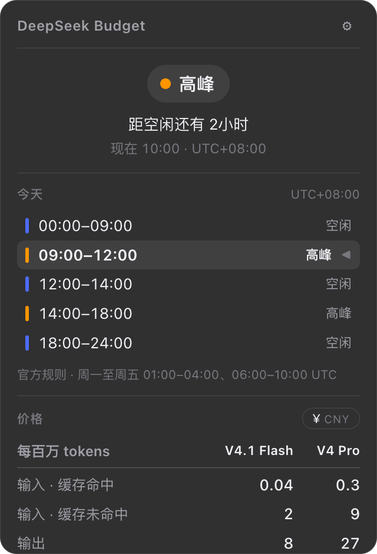

# DeepSeek Budget

[English](README.md) · **简体中文**



一个常驻 macOS 菜单栏 / Windows 任务栏的小工具，回答关于 DeepSeek API 价格的两个问题：

1. 现在是**峰价**还是**谷价**？
2. **什么时候变**，还有多久？

图标是 DeepSeek 的鲸鱼，三种颜色 —— **蓝**谷价、**橙**峰价、**灰**未知。

## 安装

从 **[Releases 页面](https://github.com/FAAATQ/DeepSeekBudget/releases/latest)** 下载最新构建。

| 平台 | 产物 | 说明 |
|---|---|---|
| **Windows** | `deepseek-budget.exe` | 免安装绿色版 —— 直接运行，托盘图标就出现了。依赖 WebView2，Windows 11 与较新的 Windows 10 已内置。 |
| **macOS** | `DeepSeek Budget.app` | 拖到任何地方双击即可。构建是 ad-hoc 签名的，首次打开需要 **系统设置 → 隐私与安全性 → 仍要打开**。 |

两个平台都不需要管理员权限，也都不在自己目录之外安装任何东西 —— 这也是它们都能提供
开机自启的原因。

## 它能做什么

- **一个永远正确的托盘图标**，由后台线程上的 Rust 引擎驱动。弹窗关着的时候它照样变色。
- **悬浮提示**：当前状态、下次变价时间、当前价格。Windows 的托盘提示有 127 字符上限，
  所以 Windows 用压缩过的三行形式。
- **弹窗**：今天的完整时段表、倒计时，以及每个模型的价格表。
- **改价不必发新版本。** 设置面板里有一个「检查更新」按钮，从一个小型公开配置仓库拉取最新
  价格与时段 —— 官方改了价，这个 app 不需要发新版本。二进制里内置的那份是兜底，所以
  **点不点这个按钮，app 的行为完全一样**。
- **开机自启**，默认关闭。两个平台都不需要安装器；每次启动都会把登录项重新指向 app 当前
  的位置，所以绿色包被搬走之后仍然有效。
- **中英双语**，跟随系统语言。

### 网络

这个 app 能发出的对外请求**只有一个**，且只在用户点「检查更新」时发出。不轮询、不启动时
上报、不加遥测。Rust 依赖树里**没有** HTTP 客户端、**没有** TLS 栈 —— 那一次 `fetch` 走的是
webview 自带的 TLS，且受一条只放行**一个域名**的 CSP 约束。

## 开发

前置：Rust（stable ≥ 1.90）、Node（只为拿 Tauri CLI），macOS 上还需要 Xcode Command Line
Tools（**不是**完整 Xcode）。

```bash
npm install                                 # 只为拿 @tauri-apps/cli
npm run dev                                 # 启动，图标出现在菜单栏

cargo test --workspace                      # 127 个测试
cargo test -p deepseekbudget-schedule       # 只跑引擎，约 0.6 秒

npx tauri build --bundles app               # macOS .app
cargo build --release -p deepseek-budget    # Windows 免安装 exe
```

引擎（`crates/schedule`）**零 Tauri 依赖**，且从不自己读系统时钟 —— 「现在」永远是参数传进去的。
这正是每一个峰谷边界都能无头测试的原因。

## 已知局限

1. **时区按固定 UTC 偏移建模。** 对没有夏令时的时区是精确的（包括这个 app 主要面向的 UTC+8），
   其他时区则是有据可查的近似。峰谷**判定**永远在 UTC 里做，所以状态永远是对的 ——
   只有显示的本地时间可能差一小时。
2. **「操作系统真的会在登录时执行登录项」是推断，不是观测。** 登录项的内容、自愈、
   以及（Windows 上）「那条命令行确实拉得起托盘图标」都验过，但**两台机器都没有注销或重启过**。
3. **没有单实例保护。** 启动两次就是两个托盘图标。

## 文档

代码可以读。**为什么这么设计、每个平台实际上是什么样**，读不出来。

| 文档 | 内容 |
|---|---|
| [`docs/domain-pricing.md`](docs/domain-pricing.md) | 这个 app 编码的 DeepSeek 峰谷规则、时区是怎么建模的，以及官方 API 究竟能让你计量到什么程度 |
| [`docs/windows.md`](docs/windows.md) | Windows 这一侧付出了什么代价：弹窗定位、前台锁、亚克力为什么必须用直角、127 字符的 tooltip 上限，以及自动化验证 Windows UI 的三个坑 |
| [`docs/macos.md`](docs/macos.md) | 一个返回零高度矩形的 `tray.rect()`、一个收逻辑点却拿到物理像素的显示器查找、圆角归谁裁，以及一条被推翻的「哪个平台更好验证」结论 |
| [`docs/icon-pipeline.md`](docs/icon-pipeline.md) | 托盘图标是怎么产出的、画布为什么是 49×36 而不是正方形，以及与在售菜单栏 app 的实测对比 |

## 许可

MIT，见 [`LICENSE`](LICENSE)。DeepSeek 鲸鱼 logo 归 DeepSeek 所有；本项目与官方无隶属关系。
